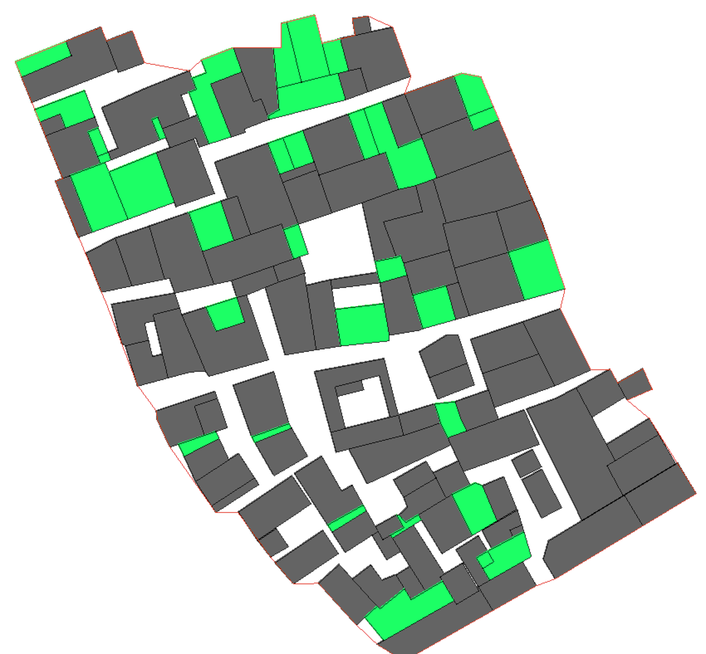

# Import-DXF

This library imports polylines from DXF file, based on the **kabeja** library.

**dependency**: kabeja-0.4.jar

example:
//read all polylines from one layer
double[][][] polygons = DXFImport.polylines_layer("/Users/huahao/Documents/labAAA teaching/5th 9xiao/poly0.dxf", "poly");

//read multiple layers
String[] layerNames = { "poly", "vd", "bound" };
double[][][][] all = DXFImport.polylines_layers("/Users/huahao/Documents/labAAA teaching/5th 9xiao/poly0.dxf", layerNames);

